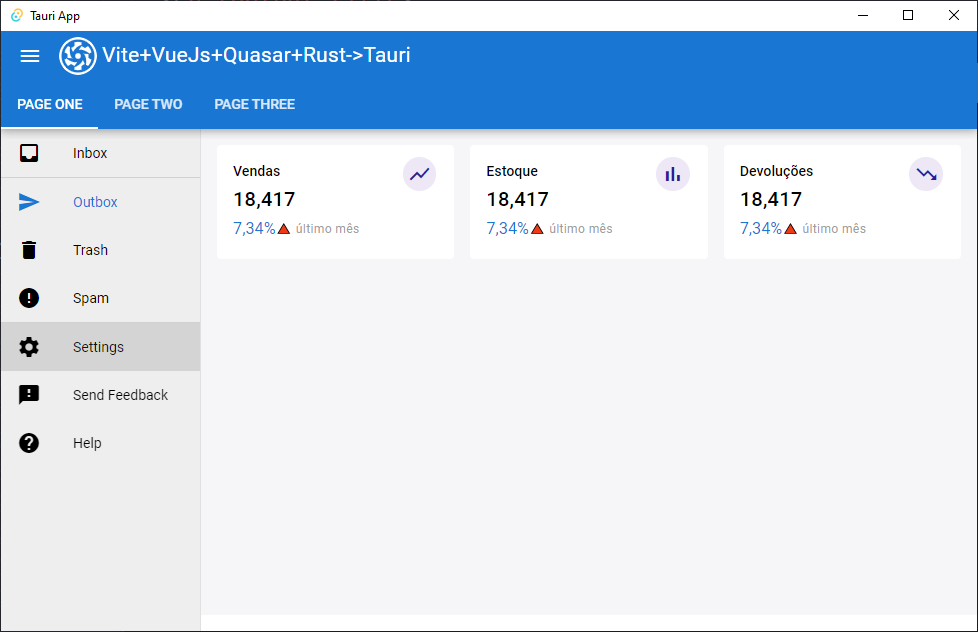
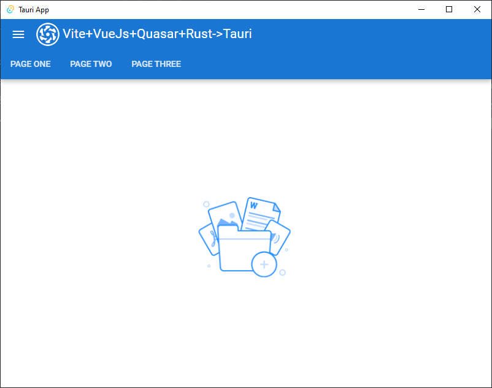
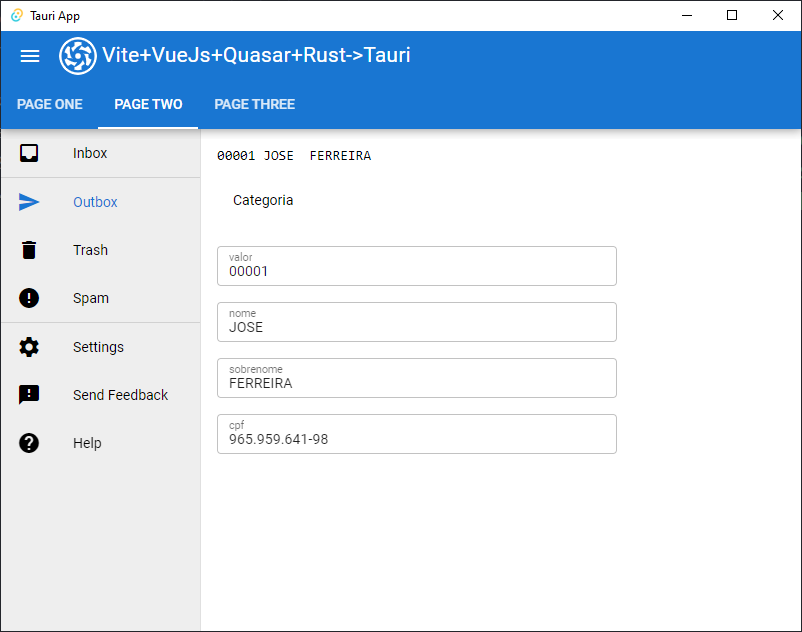
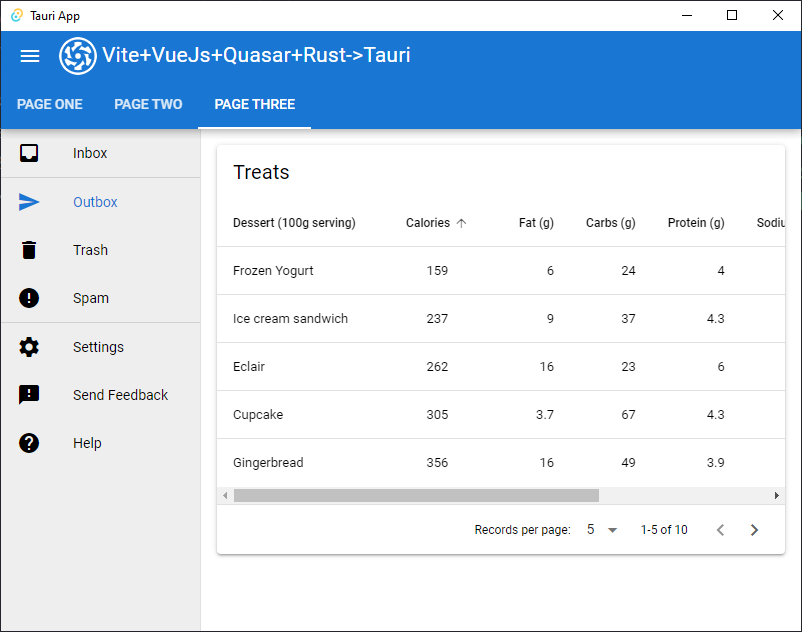

#### This template help us to compile Vue.js with Tauri and Rust

Tauri is a tool very similar to Electron, to generate cross-platform apps
It runs like a Rust binary

Vue.js + Quasar
Vite + Tauri


  
This template have the following resources
- [x] Vue.js 3.0 
- [x] Quasar UI // Support to [quasar](https://quasar.dev/)
- [x] [Vite](https://vitejs.dev/) 
- [x] i18n // Internationalization and multi languagem support
- [x] axios // http request
- [x] routes // routes with or without parameters
- [x] Vue components  
- [x] pinia // a global store library
- [x] Icons

# Requirements

Techonologies
https://vitejs.dev/   
https://vuejs.org/  
https://quasar.dev/   
https://tauri.app/  

Check the Material Design Guide
https://m3.material.io/

Learn Rust
rust-lang.org/
rust-lang.org/pt-BR/

## Before install

check if you have the following environment 
```shell
# https://nodejs.org/pt-br/ # node > 14
npm install --global yarn # yarn
yarn global add @vue/cli # vue cli
yarn global add @quasar/cli # quasar cli
```

## Rust  

This project uses Tauri
It helps you to deploy well fashioned apps like Electron Apps

Install Rust 
rust-lang.org/pt-BR/tools/install

Then install Tauri
```shell
cargo install create-tauri-app
```

# Configure Tauri

It has been created with command `cargo create-tauri-app` or similar `yarn create tauri-app`

# 
To use Vite
```shell
 yarn create vite
 
 cd lab/
 yarn create tauri-app
 
```
# Clone this repositório
```shell
git clone https://github.com/[seuusuario]/vite-quasar-tauri-template.git
yarn #Install dependencies
```

## How to run
```bash
yarn 
quasar dev
```

## Build Java Script

```bash
quasar build
```

## Build the deployable binary

```
cargo build 
cargo build --release
cargo run
```



